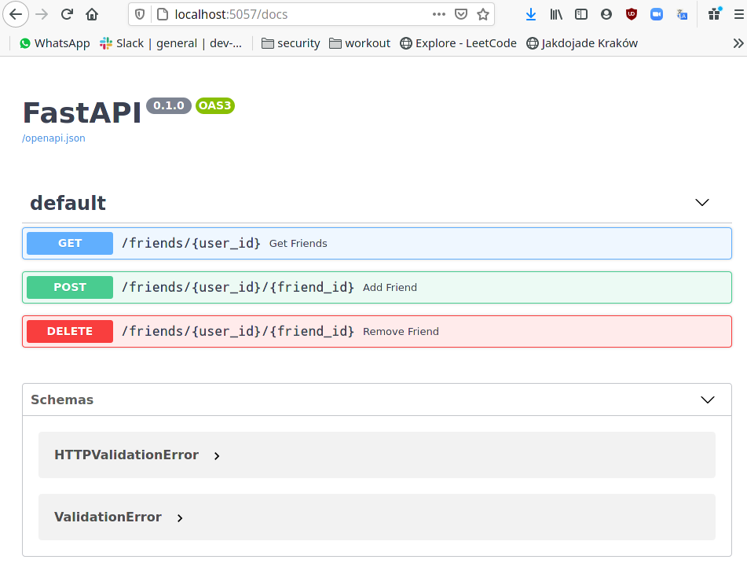
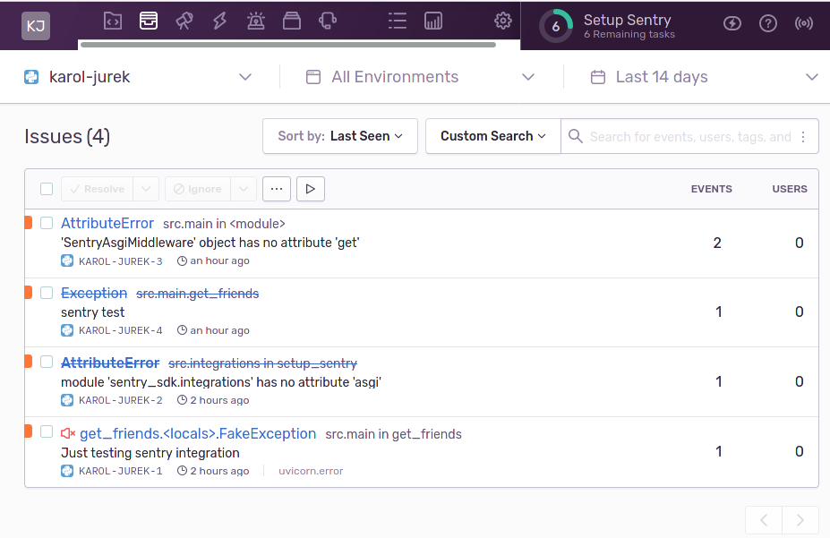
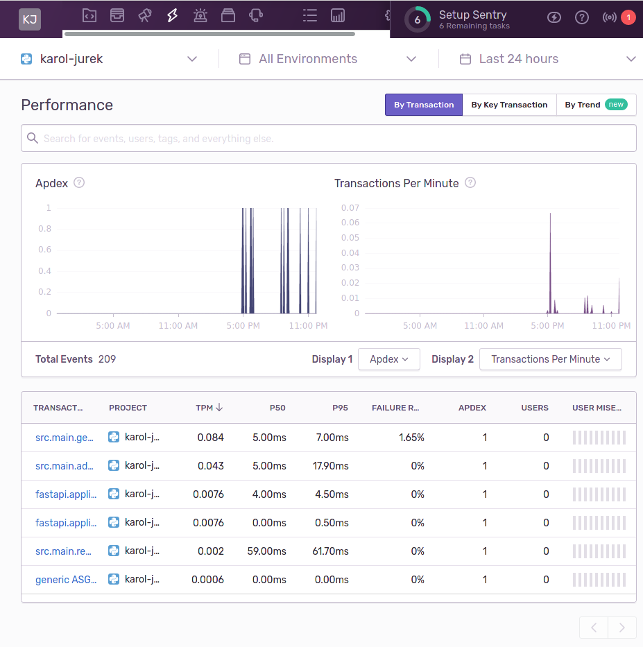

# Friends application

## Build status
[](https://travis-ci.com/kjurek/friends)

## Architecture


## Usage

### Dependencies
- [docker](https://docs.docker.com/get-docker)
- [docker-compose](https://docs.docker.com/compose/install)

### Build
Project includes Makefile with helper commands for building, runing and testing the application.
There are two docker files, `friends_service/docker/Dockerfile` is for production use and `friends_service/docker/DockerfileTests` is for testing, linting and requirements generation.

```
git clone git@github.com:kjurek/friends.git
cd friends/friends_service
make build
```

### Python requirements
Requirements generator generates `requirements.txt` file from `requirements.in` file using proper python version.
It may ask for a sudo password because docker is launching as a root user so generated file owner is root.
To avoid this problem this make step includes `sudo chown $(USER):$(USER) requirements.txt` command.

```
make requirements
```

### Linter
Checks code with flake-8 and bandit

```
make lint
```

### Tests
Runs unit tests

```
make test
```

### Run
Runs main application

```
make run

```

### Environments and configuration
Currently there is only one production-like environment `dev` and it's called `friends_service` in `docker-compose.yml`.
There is also a testing service which has separate PostgreSQL and Redis instances to avoid deleting data from other environments, it's called `friends_service_tests`.
Both services are configured using environment variables which are stored in the `friends_service/env` folder.

### Usage
When application is running it publish following endpoints:
- Main application endpoint which handles adding/removing/getting friends: http://localhost:5057/friends
- Swagger documentation with tool for sending requests: http://localhost:5057/docs


### CI/CD
There is a simple travis configuration for building branches on github.
It launches unit tests and linters.
https://travis-ci.com/github/kjurek/friends

### Performance and monitoring
Application is integrated with Sentry which tracks exceptions and application traffic.
Currently only I have access to Sentry but I can send invitations if needed.
https://sentry.io/organizations/karol-jurek/issues/?project=5509980




